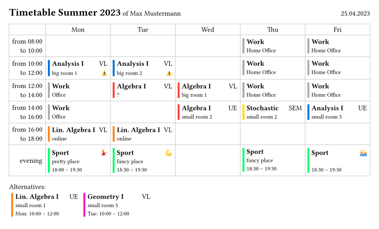

# typst-timetable
[GitHub Repository including Examples and Changelog](https://github.com/ludwig-austermann/typst-timetable)

A typst template for timetables

## Features
A resulting timetable looks like this:


- Collision detection
- Automatic extension over multiple fields / cells / time slots
- ...

## Usage
The main difficulty lies in defining the dictionary with the necessary data. Take a look into the example to see how a `json` or `toml` file can be used to specify the data, which can then be included into `.typ` files.

### Functions
The exposed `timetable` function takes the following arguments:
- `all-data`: is the necessary data input
- `language: "en"`: the language to use for weekdays and other terms
- `date: datetime.today().display("[day].[month].[year]")`: the date to be displayed in the header
- `show-header: true`: if to show the header
- `show-alternatives: true`: if to show collisions and their corresponding alternatives
- `show-description: true`: if to show the description table
- `tablex-args: (:)`: arguments to be passed to the underlying tablex table, to overwrite the style
- `event-cell: default-blocks.event-cell`: how to display the events
- `time-cell: default-blocks.time-cell`: how to display the time cells
- `color-theme: tab`: for automatical coloring of courses

### Data Dictionary
```
general
    period
    person
    times: array
        start [end - defaults.duration]
        end [start + defaults.duration]
        display: string [start "--" end]
        show-time [false]

defaults
    duration [2]

description?: array
    id
    title
    type: text|link|content [text]

courses: {abbrv}?: string ->
    {description.id}?
    color?
    priority [0]
    hide [false]
    hide-description [false]
    events: {eventtype}?: string ->
        day
        start [end - default.duration]
        end [start + default.duration]
        room
        priority [thiscourse.priority]
        hide [false]
```

Here `?` denotes optional values, `[]` the corresponding default value, `{}` parametrices keys and `->` denotes another dictionary.

Necessary are only a few options, for a quick start look at this simplified version:
```
general
    period
    person
    times: array
        start or end

courses: {abbrv}?: string ->
    events: {eventtype}?: string ->
        day
        start or end
        room
```

Take a look at the example files, currently only the `toml` ones show all options.

## Typst Usage Tipp
I plan to eventually release this as a package to typst packages. Until then, or additionally, you can place this in your local packages repo. If you use the web app, 