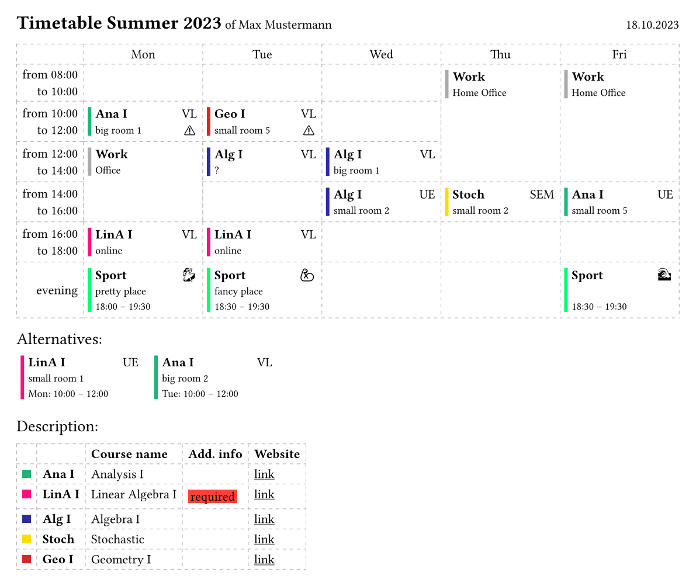

# typst-timetable
A typst template for timetables

## Features
A resulting timetable looks like this:

- Collision detection
- Automatic extension over multiple fields / cells / time slots
- ...

## Usage
The main difficulty lies in defining the dictionary with the necessary data. Take a look into the example to see how a json file can be used to specify the data, which can then be included into `.typ` files.

## Git/Typst Usage Tipp
If you want your own project to be git controlled, but still want to recieve updates from this repo, you can use git submodules.